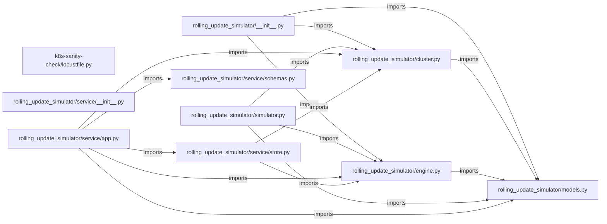

# rolling-update-simulator — project architecture

[README](readme.md) · [Interview questions and answers](INTERVIEW_QA.md)

## Purpose and scope

A Python simulator and interactive showcase for safe rolling deployments under capacity, availability, and resource constraints.

This document describes files and symbols in this checkout. Deployment templates and statements in the original overview are distinguished from a verified running environment.

## Component diagram



For Python repositories, arrows show resolved local imports, not network calls or deployment order. Otherwise the diagram is a repository component map; containment arrows do not assert runtime integration.

## Components and responsibilities

| Component | Responsibility |
| --- | --- |
| [`rolling_update_simulator/service/app.py`](rolling_update_simulator/service/app.py) | HTTP handlers: `POST /rollouts`, `GET /rollouts`, `GET /rollouts/{rollout_id}`, `DELETE /rollouts/{rollout_id}`, `POST /rollouts/{rollout_id}/tick` |
| [`rolling_update_simulator/cluster.py`](rolling_update_simulator/cluster.py) | Functions: `always_healthy`, `apply`, `tick`, `active_count`, `ready_count`, `_find` |
| [`rolling_update_simulator/engine.py`](rolling_update_simulator/engine.py) | Functions: `__post_init__`, `min_available`, `max_active`, `__init__`, `config`, `record_failure`, `plan` |
| [`rolling_update_simulator/simulator.py`](rolling_update_simulator/simulator.py) | Functions: `run`, `_report`, `_seed`, `_demo_healthy_rollout`, `_demo_failing_new_version` |
| [`k8s-sanity-check/locustfile.py`](k8s-sanity-check/locustfile.py) | Functions: `label_for`, `hit_root` |
| [`rollout-architecture.html`](rollout-architecture.html) | Implementation or supporting configuration |
| [`rollout-simulator.html`](rollout-simulator.html) | Implementation or supporting configuration |
| [`requirements.txt`](requirements.txt) | Implementation or supporting configuration |
| [`k8s-sanity-check/loadtest-with-rollout.sh`](k8s-sanity-check/loadtest-with-rollout.sh) | Implementation or supporting configuration |
| [`k8s-sanity-check/loadtest.sh`](k8s-sanity-check/loadtest.sh) | Implementation or supporting configuration |
| [`rolling_update_simulator/__init__.py`](rolling_update_simulator/__init__.py) | Implementation or supporting configuration |
| [`rolling_update_simulator/models.py`](rolling_update_simulator/models.py) | Functions: `is_active`, `is_ready`, `__str__` |
| [`tests/__init__.py`](tests/__init__.py) | Executable checks and regression examples |
| [`tests/test_engine.py`](tests/test_engine.py) | Executable checks and regression examples |
| [`readme.md`](readme.md) | Project explanations or operating notes |
| [`rolling_update_simulator/service/README.md`](rolling_update_simulator/service/README.md) | Project explanations or operating notes |

## Request interface

| Method and path | Handler | Source |
| --- | --- | --- |
| `POST /rollouts` | `create_rollout` | [`rolling_update_simulator/service/app.py`](rolling_update_simulator/service/app.py#L96) |
| `GET /rollouts` | `list_rollouts` | [`rolling_update_simulator/service/app.py`](rolling_update_simulator/service/app.py#L124) |
| `GET /rollouts/{rollout_id}` | `get_rollout` | [`rolling_update_simulator/service/app.py`](rolling_update_simulator/service/app.py#L129) |
| `DELETE /rollouts/{rollout_id}` | `delete_rollout` | [`rolling_update_simulator/service/app.py`](rolling_update_simulator/service/app.py#L143) |
| `POST /rollouts/{rollout_id}/tick` | `tick_rollout` | [`rolling_update_simulator/service/app.py`](rolling_update_simulator/service/app.py#L149) |
| `POST /rollouts/{rollout_id}/run` | `run_rollout` | [`rolling_update_simulator/service/app.py`](rolling_update_simulator/service/app.py#L157) |

The table lists literal route decorators found in the inspected Python modules. Router prefixes and middleware can add behavior; check the linked handler and application setup before calling an endpoint.

## Implementation walkthrough

### `tick(self)`

Source: [`rolling_update_simulator/cluster.py`](rolling_update_simulator/cluster.py#L41).

Advance every instance by one tick. Returns instances that
transitioned to FAILED this tick, for the engine to record.

Calls visible in this function: `newly_failed.append`, `self.health_check`.

```python
    def tick(self) -> List[Instance]:
        """Advance every instance by one tick. Returns instances that
        transitioned to FAILED this tick, for the engine to record."""
        newly_failed = []                                    # collected for the caller to feed into record_failure
        for instance in self.instances:
            instance.ticks_in_state += 1                      # every instance ages by one tick, regardless of state
            if instance.state is InstanceState.STARTING and instance.ticks_in_state >= self.startup_ticks:
                if self.health_check(instance):                # startup window elapsed: run the health check once
                    instance.state = InstanceState.READY
                else:
                    instance.state = InstanceState.FAILED
                    newly_failed.append(instance)               # record so the engine can count it toward rollback
                instance.ticks_in_state = 0                     # reset timer for whichever state it entered
            elif instance.state is InstanceState.TERMINATING and instance.ticks_in_state >= self.shutdown_ticks:
                instance.state = InstanceState.TERMINATED       # shutdown window elapsed: fully gone next line

        # Infra reclaims failed/terminated instances; they no longer occupy capacity.
        self.instances = [
            i for i in self.instances
            if i.state not in (InstanceState.TERMINATED, InstanceState.FAILED)
        ]
        return newly_failed
```

### `plan(self, instances: List[Instance])`

Source: [`rolling_update_simulator/engine.py`](rolling_update_simulator/engine.py#L109).

Return the actions to take this tick, given the current fleet.

Calls visible in this function: `Instance`, `self._is_settled`, `self._plan_creates`, `self._plan_terminates`.

```python
    def plan(self, instances: List[Instance]) -> List[Action]:
        """Return the actions to take this tick, given the current fleet."""
        if self.status in (RolloutStatus.COMPLETE, RolloutStatus.ROLLED_BACK):
            return []  # nothing left to do once settled

        rolling_back = self.status is RolloutStatus.ROLLING_BACK
        # Forward: grow new_version, shrink old_version. Rollback: the mirror image.
        target_version = self.old_version if rolling_back else self.new_version
        replacement_version = self.new_version if rolling_back else self.old_version

        creates = self._plan_creates(instances, target_version)
        # Project the creates so the terminate step never reasons about
        # stale ready/active counts within the same tick.
        projected = instances + [Instance(version=target_version) for _ in creates]
        terminates = self._plan_terminates(projected, replacement_version)

        if self._is_settled(projected, target_version):
            self.status = RolloutStatus.ROLLED_BACK if rolling_back else RolloutStatus.COMPLETE

        return creates + terminates  # order doesn't matter; Cluster applies both this tick
```

### `run(engine: RolloutEngine, cluster: Cluster, max_ticks: int=100, verbose: bool=False)`

Source: [`rolling_update_simulator/simulator.py`](rolling_update_simulator/simulator.py#L16).

Calls visible in this function: `RuntimeError`, `_report`, `cluster.apply`, `cluster.tick`, `engine.plan`, `engine.record_failure`.

```python
def run(engine: RolloutEngine, cluster: Cluster, max_ticks: int = 100, verbose: bool = False) -> RolloutStatus:
    tick = 0                                                     # current tick counter, for the printed log and the safety cap
    settled = (RolloutStatus.COMPLETE, RolloutStatus.ROLLED_BACK)  # terminal states that end the loop
    while engine.status not in settled and tick < max_ticks:
        status_before = engine.status                            # captured before plan() can flip it mid-tick
        actions = engine.plan(cluster.instances)                 # ask the engine what to do this tick
        cluster.apply(actions)                                   # hand the actions to the simulated infra
        for instance in cluster.tick():                          # advance lifecycles; returns newly-FAILED instances
            engine.record_failure(instance)                      # let the engine track new-version health

        if verbose:
            _report(tick, status_before, actions, cluster, engine)
        tick += 1                                                 # move to the next tick

    if engine.status not in settled:
        raise RuntimeError(f"rollout did not settle within {max_ticks} ticks")  # defensive: should be unreachable for valid configs
    return engine.status
```

### `hit_root(self)`

Source: [`k8s-sanity-check/locustfile.py`](k8s-sanity-check/locustfile.py#L37).

Calls visible in this function: `label_for`, `len`, `resp.elapsed.total_seconds`, `resp.headers.get`, `resp.success`, `self.client.get`, `self.environment.stats.log_request`.

```python
    def hit_root(self):
        with self.client.get("/", catch_response=True) as resp:
            version = label_for(resp.headers.get("Server", ""))
            # Extra row in the stats table, broken out by which backend
            # version actually served the request -- in addition to the
            # normal "/" row Locust logs automatically.
            self.environment.stats.log_request(
                "backend", version, resp.elapsed.total_seconds() * 1000, len(resp.content)
            )
            resp.success()
```

## Validation and failure paths

| Explicit exception | Source |
| --- | --- |
| `ValueError('desired_replicas must be positive')` | [`rolling_update_simulator/engine.py`](rolling_update_simulator/engine.py#L51) |
| `ValueError('max_surge and max_unavailable must be non-negative')` | [`rolling_update_simulator/engine.py`](rolling_update_simulator/engine.py#L53) |
| `ValueError('max_surge and max_unavailable cannot both be 0: there would be no room to introduce a new-version instance without breaching availability')` | [`rolling_update_simulator/engine.py`](rolling_update_simulator/engine.py#L59) |
| `ValueError('resource_capacity must be at least desired_replicas')` | [`rolling_update_simulator/engine.py`](rolling_update_simulator/engine.py#L64) |
| `RuntimeError(f'rollout did not settle within {max_ticks} ticks')` | [`rolling_update_simulator/simulator.py`](rolling_update_simulator/simulator.py#L31) |
| `HTTPException(status_code=404, detail=f'no rollout with id {rollout_id!r}')` | [`rolling_update_simulator/service/app.py`](rolling_update_simulator/service/app.py#L70) |
| `HTTPException(status_code=404, detail=f'no rollout with id {rollout_id!r}')` | [`rolling_update_simulator/service/app.py`](rolling_update_simulator/service/app.py#L145) |
| `HTTPException(status_code=409, detail=f'rollout already settled as {rollout.engine.status.value}')` | [`rolling_update_simulator/service/app.py`](rolling_update_simulator/service/app.py#L152) |
| `HTTPException(status_code=409, detail=f'rollout already settled as {rollout.engine.status.value}')` | [`rolling_update_simulator/service/app.py`](rolling_update_simulator/service/app.py#L160) |
| `HTTPException(status_code=422, detail=str(exc))` | [`rolling_update_simulator/service/app.py`](rolling_update_simulator/service/app.py#L106) |

These are explicit exceptions in the inspected source, rather than a claim that every failure is handled. Follow the calling handler to see whether the exception becomes an HTTP response or propagates.

## Data and state

- [`k8s-sanity-check/locustfile.py`](k8s-sanity-check/locustfile.py) defines module-level containers: `VERSION_TAGS`.
- [`rolling_update_simulator/__init__.py`](rolling_update_simulator/__init__.py) defines module-level containers: `__all__`.

Module-level dictionaries/lists live in a Python process. They can be fixtures or mutable state; inspect writes before treating them as persistent storage. A production extension would need to define persistence and concurrency behavior explicitly.

## Data flow and design decisions

### What is the input-to-output contract of `tick`

In [`rolling_update_simulator/cluster.py`](rolling_update_simulator/cluster.py#L41), `tick(self)` receives the inputs. The function computes these intermediate values:

- `newly_failed = []`
- `self.instances = [i for i in self.instances if i.state not in (InstanceState.TERMINATED, InstanceState.FAILED)]`

Its result is defined by:

- `newly_failed`

### Which decision rules or boundary conditions should an interviewer challenge

The implementation in [`rolling_update_simulator/cluster.py`](rolling_update_simulator/cluster.py#L41) branches on:

- `instance.state is InstanceState.STARTING and instance.ticks_in_state >= self.startup_ticks`
- `self.health_check(instance)`
- `instance.state is InstanceState.TERMINATING and instance.ticks_in_state >= self.shutdown_ticks`

A useful extension is a table-driven test that covers each condition just below, at, and above its boundary where applicable. These expressions are the current rules; changing them changes behavior and should be justified by the project’s acceptance criteria.

## Setup and verification

The following commands are derived from the checked-in dependency/test contracts. Execute them from the repository root; the block prepares a local environment, not a cloud deployment.

```bash
python3 -m venv .venv
source .venv/bin/activate
python -m pip install -r requirements.txt
```

Python dependencies: [`requirements.txt`](requirements.txt).

Test entry points: [`tests/__init__.py`](tests/__init__.py), [`tests/test_engine.py`](tests/test_engine.py).

## Operating boundaries and design review

Before turning this checkout into a customer deployment, establish the input contract, data ownership, access controls, failure response, evaluation criteria, and rollback owner. Repository fixtures and unit tests demonstrate local behavior; they do not establish throughput, uptime, compliance, or business impact.

A useful architecture review starts with the linked implementation: identify where input enters, where a decision is made, which state can change, and which external dependency can fail. Add a deployment view only for infrastructure that is actually configured and exercised.
